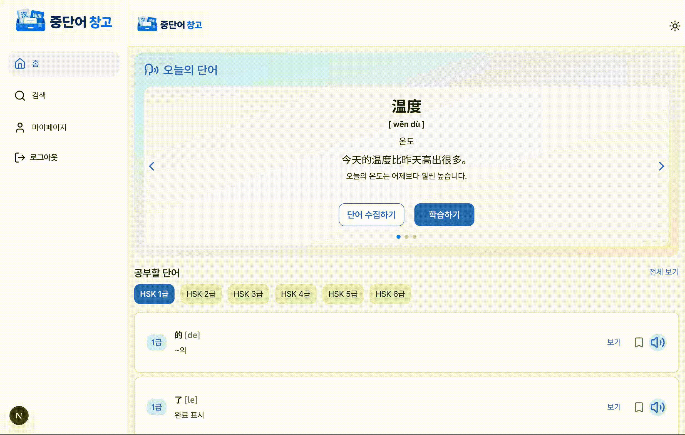
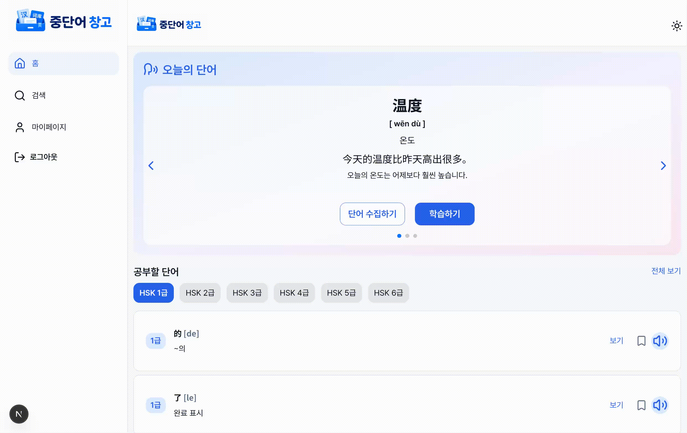

<h1 align="center">
 🐼 중단어 창고 🐼
</h1>

<div align = "center">
<p align="center">
 중단어 창고 배포 사이트 이동 ⬇️
</p>
<a href="https://hanzi-bank.vercel.app/">
   
</a>

</div>

## 📌 프로젝트 소개

- **프로젝트명**: 중단어 창고
- **개발 기간**: 2026.06.15 ~ 2026.06.29, 08.01~ 08.27
- **소개**:
  중국어 단어를 검색하고 저장하는 것에서 그치지 않고, 저장한 단어를 활용해 직접 예문을 작성하며 학습할 수 있는 모든 사용자를 고려한 중국어 학습 플랫폼입니다.

## 📋 목차

- [기술 스택](#-기술-스택)
- [주요 기능](#-주요-기능)
- [폴더 구조](#-폴더-구조)
- [화면 구성](#-화면-구성)
- [사용 방법](#-사용-방법)

<br />

# 🛠 기술 스택

| 구분                   | 도입 기술                          | 도입 목적 및 기대효과                                                        |
| ---------------------- | ---------------------------------- | ---------------------------------------------------------------------------- |
| **핵심 기술**          | Next.js 16, TypeScript             | 빠른 렌더링, SEO 최적화 및 안정적인 타입 관리                                |
| **상태관리**           | zustand, tanstack query            | 전역 상태 관리, 서버 상태 캐싱 및 데이터 요청 상태 관리                      |
| **UI**                 | swiper, lucide-react, tailwind css | 슬라이드 UI 구현 및 개발 생산성 향상, 일관된 스타일링 제공                   |
| **유효성 검사 & 보안** | zod, react-hook-form               | 폼 상태 관리 및 유효성 검증을 효율적으로 처리                                |
| **백엔드 & 배포**      | supabase, vercel                   | 서버 구축 최소화 및 개발 효율 증대, 무설정 배포 및 next.js 완벽 호환         |
| **개발 환경**          | bun, eslint&prettier               | 자체 런타임 환경을 통해 더 빠른 패키지 설치와 실행, 코드 품질 및 컨벤션 통일 |

<br />

# 🗣️ 주요 기능

## 오늘의 단어 추천

- 매일 학습할 중국어 단어를 랜덤으로 추천

## 중단어 검색

- 중국어 단어 또는 중단어의 한국어 뜻으로 검색 가능
- 음성을 통해 검색어 입력 기능

## HSK 급수별 단어 조회

- HSK 급수별에 따른 단어 목록 조회 및 학습
- 급수별 목록에서 단어 클릭 시 해당 단어 상세 정보 조회 가능

## 단어 저장하기

- 로그인한 사용자일 경우, 중단어 저장 가능
- 단어를 클릭에 따라 저장/ 저장 해체 가능

## 마이페이지

### 나의 단어

- 사용자가 저장한 단어 조회
- 저장한 단어 예문 생성 기능
- 음성으로 예문 입력 가능

### 나의 예문

- 나의 단어 페이지에서 작성된 예문 조회
- 작성한 예문 수정 또는 삭제 가능

### 설정

- 사용자 정보 수정 (닉네임, 이메일)
- 나의 중국어 급수 변경
- 회원 탈퇴

## 다크모드/ 라이트 모드 지원

- 다크모드/라이트 모드를 사용자가 직접 선택할 수 있는 아이콘 토글 버튼 제공

<br />

# 🗂️ 폴더 구조

| 디렉토리         | 역할                                   |
| ---------------- | -------------------------------------- |
| `app/`           | Next.js App Router 기반 페이지 및 기능 |
| `api/`           | API 요청 함수                          |
| `components/ui/` | 공통 UI 컴포넌트                       |
| `hooks/`         | 커스텀 Hook                            |
| `lib/`           | 공통 로직 및 Supabase 설정             |
| `stores/`        | Zustand 전역 상태                      |
| `types/`         | 공통 타입 정의                         |

<details>
<summary><b>📁 전체 트리 펼쳐보기</b></summary>

```text
src
├── app
│   ├── (auth)
│   │   ├── components
│   │   │   ├── AuthEmailSync.tsx
│   │   │   ├── ForgotPasswordAuthForm.tsx
│   │   │   ├── ForgotPasswordSection.tsx
│   │   │   ├── LoginForm.tsx
│   │   │   ├── LoginRequiredModal.tsx
│   │   │   ├── LoginToGoogle.tsx
│   │   │   ├── Logout.tsx
│   │   │   ├── ResetButton.tsx
│   │   │   └── SignUpForm.tsx
│   │   ├── find-password
│   │   │   └── page.tsx
│   │   ├── layout.tsx
│   │   ├── login
│   │   │   └── page.tsx
│   │   ├── resetPassword
│   │   │   ├── components
│   │   │   │   ├── ResetPasswordAuth.tsx
│   │   │   │   ├── ResetPasswordForm.tsx
│   │   │   │   ├── ResetPasswordSection.tsx
│   │   │   │   └── ResetPasswordSuccess.tsx
│   │   │   └── page.tsx
│   │   ├── schemas
│   │   │   ├── forgotpasswordSchemas.ts
│   │   │   ├── loginSchemas.ts
│   │   │   ├── passwordResetSchemas.ts
│   │   │   ├── searchSchemas.ts
│   │   │   └── signupSchemas.ts
│   │   └── signup
│   │       └── page.tsx
│   ├── (main)
│   │   ├── hsk-level-words
│   │   │   ├── [level]
│   │   │   │   ├── [id]
│   │   │   │   │   ├── components
│   │   │   │   │   │   └── WordDetailCard.tsx
│   │   │   │   │   └── page.tsx
│   │   │   │   ├── components
│   │   │   │   │   ├── DetailHskLevelList.tsx
│   │   │   │   │   ├── HskLevelWordsHeader.tsx
│   │   │   │   │   └── HskWordFilter.tsx
│   │   │   │   ├── loading.tsx
│   │   │   │   └── page.tsx
│   │   │   └── page.tsx
│   │   ├── layout.tsx
│   │   ├── mypage
│   │   │   ├── components
│   │   │   │   └── MypageGuide.tsx
│   │   │   ├── mySentence
│   │   │   │   ├── components
│   │   │   │   │   ├── DeleteMySentenceBtn.tsx
│   │   │   │   │   ├── ModifySentenceBtn.tsx
│   │   │   │   │   ├── MySentenceSection.tsx
│   │   │   │   │   ├── MysentenceFormActionBtn.tsx
│   │   │   │   │   └── mySentenceCard.tsx
│   │   │   │   └── page.tsx
│   │   │   ├── myWord
│   │   │   │   ├── components
│   │   │   │   │   ├── AddWordExample.tsx
│   │   │   │   │   ├── DeleteMyWord.tsx
│   │   │   │   │   ├── ExampleForm.tsx
│   │   │   │   │   ├── ExampleInputSection.tsx
│   │   │   │   │   ├── FormActionButton.tsx
│   │   │   │   │   ├── MyWordCard.tsx
│   │   │   │   │   ├── MyWordSection.tsx
│   │   │   │   │   └── VoiceInputButton.tsx
│   │   │   │   └── page.tsx
│   │   │   ├── page.tsx
│   │   │   └── settings
│   │   │       ├── components
│   │   │       │   ├── DeleteAccoutSection.tsx
│   │   │       │   ├── HskLevelSection.tsx
│   │   │       │   ├── ProfileSection.tsx
│   │   │       │   └── SettingsSection.tsx
│   │   │       └── page.tsx
│   │   ├── page.tsx
│   │   └── search
│   │       ├── components
│   │       │   ├── SearchFilter.tsx
│   │       │   ├── SearchForm.tsx
│   │       │   ├── SearchResult.tsx
│   │       │   └── VoiceForm.tsx
│   │       └── page.tsx
│   ├── api
│   │   ├── account
│   │   │   └── delete
│   │   │       └── route.ts
│   │   ├── checkNickname.ts
│   │   ├── createUser.ts
│   │   ├── createUserExamples.ts
│   │   ├── deleteAccount.ts
│   │   ├── deleteMySentence.ts
│   │   ├── deleteMyWord.ts
│   │   ├── fetchAllHskLevelWords.ts
│   │   ├── fetchHskLevelCounts.ts
│   │   ├── fetchHskWordDetail.ts
│   │   ├── fetchMainLevelWord.ts
│   │   ├── fetchSearchWord.ts
│   │   ├── fetchTodayWords.ts
│   │   ├── fetchUser.ts
│   │   ├── getIsSavedWord.ts
│   │   ├── getMySentenceCount.ts
│   │   ├── getMySentences.ts
│   │   ├── getMyWordCount.ts
│   │   ├── getMyWords.ts
│   │   ├── getUserProfile.ts
│   │   ├── login.ts
│   │   ├── loginWithGoogle.ts
│   │   ├── logout.ts
│   │   ├── resetUserPassword.ts
│   │   ├── saveWord.ts
│   │   ├── signup.ts
│   │   ├── syncUserEmail.ts
│   │   ├── updateMysentence.ts
│   │   ├── updateUserEmail.ts
│   │   ├── updateUserLevel.ts
│   │   ├── updateUserPassword.ts
│   │   ├── updateUserProfile.ts
│   │   └── uploadProfileImage.ts
│   ├── auth
│   │   └── callback
│   │       └── route.ts
│   ├── favicon.ico
│   ├── globals.css
│   └── layout.tsx
├── components
│   ├── providers
│   │   ├── QueryProvider.tsx
│   │   └── ThemeProvider.tsx
│   └── ui
│       ├── BackButton.tsx
│       ├── ConfirmModal.tsx
│       ├── DarkMode.tsx
│       ├── Footer.tsx
│       ├── Header.tsx
│       ├── HskLevelCardList.tsx
│       ├── HskLevelWords.tsx
│       ├── MainMobileSidebar.tsx
│       ├── MainSidebar.tsx
│       ├── MovetoWordDetails.tsx
│       ├── MypageMobileSidebar.tsx
│       ├── MypageSidebar.tsx
│       ├── Pagination.tsx
│       ├── SaveWordBtn.tsx
│       ├── SearchModal.tsx
│       ├── Sidebar.tsx
│       ├── SidebarMobile.tsx
│       ├── SoundButton.tsx
│       ├── TodayWord.tsx
│       ├── TodayWordSwiper.tsx
│       ├── UserGuilde.tsx
│       ├── UserGuildeInfo.tsx
│       ├── alert-dialog.tsx
│       ├── button.tsx
│       └── select.tsx
├── constants
│   ├── hskLevelStyle.ts
│   ├── navigation.ts
│   ├── posToKo.ts
│   └── voiceStatus.ts
├── fonts
│   └── PretendardVariable.woff2
├── hooks
│   ├── useCreateUserExamples.ts
│   ├── useDeleteAccount.ts
│   ├── useDeleteMySentence.ts
│   ├── useDeleteMyWord.ts
│   ├── useIsSavedWord.ts
│   ├── useMySentenceCount.ts
│   ├── useMyWordCount.ts
│   ├── useMysentences.ts
│   ├── useMywords.ts
│   ├── useProfile.ts
│   ├── useSaveWord.ts
│   ├── useSession.ts
│   ├── useSpeechRecognition.ts
│   ├── useSyncAuthEmail.ts
│   ├── useSyncUserEmail.ts
│   ├── useUpdateEmail.ts
│   ├── useUpdateMySentence.ts
│   ├── useUpdateUserProfile.ts
│   └── useUpdateUserlevel.ts
├── lib
│   ├── fonts.ts
│   ├── speech.ts
│   ├── supabase
│   │   ├── admin.ts
│   │   ├── client.ts
│   │   └── server.ts
│   ├── utils.ts
│   └── validation
│       ├── chinese.ts
│       └── korean.ts
├── proxy.ts
├── stores
│   ├── loginModalStore.ts
│   └── searchModalStore.ts
└── types
    ├── DBTypes.ts
    └── web-speech.d.ts
```

</details>

  </td></tr>
</table>

<br />

# 🖥 화면 구성

### 메인


오늘의 단어와 HSK 급수별 학습 기능을 제공합니다.

<br/>

### 단어 검색



중국어 단어 또는 한국어 뜻으로 검색하고 음성으로 검색어를 입력할 수 있습니다.

<br/>

### 단어 상세


급수별 중단어 목록 조회 및 해당 단어 뜻과 예문을 확인할 수 있습니다.

<br/>

### 마이페이지



사용자가 저장한 단어 조회 및 예문을 작성하고, 회원 정보를 수정할 수 있습니다.
<br/>

# 🚀 사용 방법

# 1. 저장소 클론

```
git clone https://github.com/your-repo/hanzi-bank.git
```

# 2. 프로젝트 폴더 이동

```
cd hanzi-bank
```

# 3. 환경 변수 설정

```
NEXT_PUBLIC_SUPABASE_URL="https://[여기는본인의고유알파벳].supabase.co"
NEXT_PUBLIC_SUPABASE_PUBLISHABLE_KEY="공개키"
```

# 4. 패키지 설치

```
bun install
```

# 5. 개발 서버 실행

```
bun dev
```

👉 실행 후 브라우저에서 [http://localhost:3000](http://localhost:3000/) 접속

---
